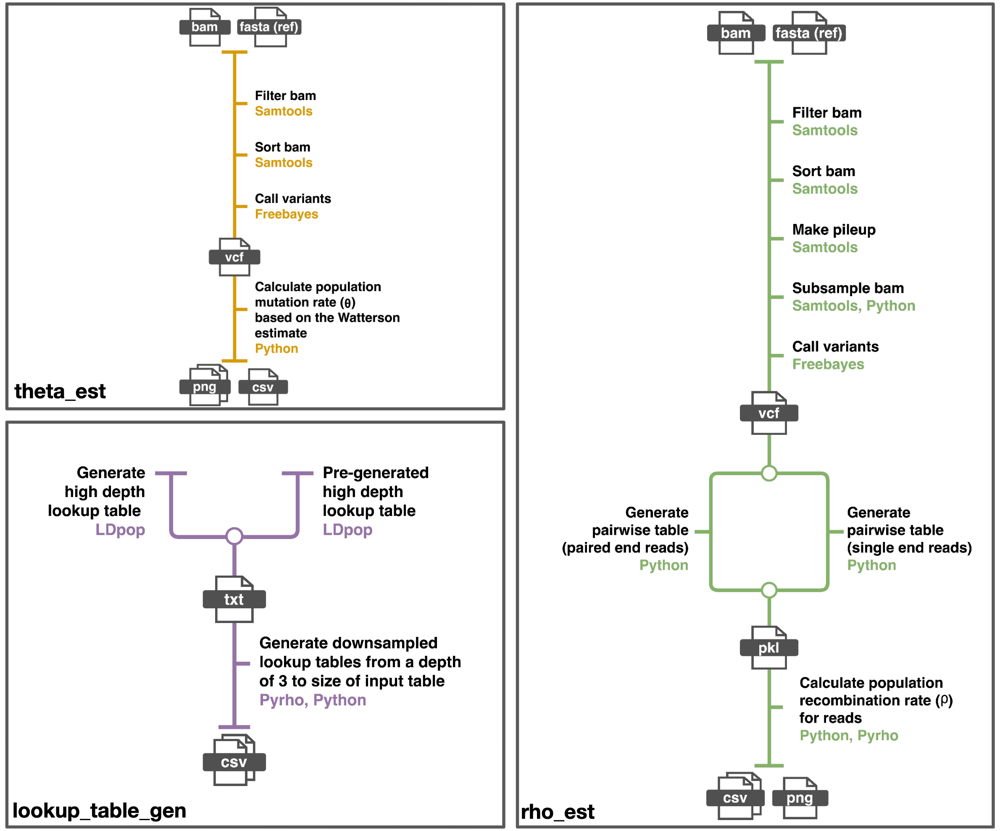

<div id="top"></div>

<!-- PROJECT LOGO -->
<br />

[//]: # (<div align="center">)

[//]: # ()
[//]: # (  <a href="https://github.com/sid-krish/rhometa">)

[//]: # ()
[//]: # (    )

[//]: # ()
[//]: # (  </a>)

<h1 align="center">Rhometa</h1>

  <p align="center">
    Metagenomic Population Recombination Rate Estimation Pipeline

[//]: # (    <br />)

[//]: # (    <a href="https://github.com/github_username/repo_name"><strong>Explore the docs »</strong></a>)

[//]: # (    <br />)

[//]: # (    <br />)

[//]: # (    <a href="https://github.com/github_username/repo_name">View Demo</a>)

[//]: # (    ·)

[//]: # (    <a href="https://github.com/github_username/repo_name/issues">Report Bug</a>)

[//]: # (    ·)

[//]: # (    <a href="https://github.com/github_username/repo_name/issues">Request Feature</a>)
  </p>

[//]: # (</div>)


<!-- TABLE OF CONTENTS -->
<details>
  <summary>Table of Contents</summary>
  <ol>
    <li>
      <a href="#about-the-project">About The Project</a>
    </li>
    <li>
      <a href="#getting-started">Getting Started</a>
      <ul>
        <li><a href="#prerequisites">Prerequisites</a></li>
        <li><a href="#installation">Installation</a></li>
      </ul>
    </li>
    <li><a href="#usage">Usage</a></li>
    <li><a href="#roadmap">Roadmap</a></li>
    <li><a href="#contributing">Contributing</a></li>
    <li><a href="#license">License</a></li>
    <li><a href="#contact">Contact</a></li>
    <li><a href="#acknowledgments">Acknowledgments</a></li>
  </ol>
</details>


<!-- ABOUT THE PROJECT -->
## About The Project

[//]: # ([![Product Name Screen Shot][product-screenshot]]&#40;https://example.com&#41;)

Rhometa is a composite likelihood based population recombination rate
estimator that can be applied directly on aligned, shotgun metagenomic read based datasets in the form of bam files.


### Built With

* [Python](https://www.python.org/)
* [Nextflow](https://www.nextflow.io/)

<!-- GETTING STARTED -->
## Getting Started

Rhometa designed to be run on linux and requires nextflow to be installed. 
Dependencies are resolved either via conda or docker images. Support for HPC, docker, singularity, AWS
and many other systems are provided via nextflow.

While it is possible to resolve the dependencies using conda for running on macOS, its recommended that this option be used on linux systems for which it has been extensively test.
If running on macOS it recommended that docker be used with the provided image, in which case it is similar to running in a linux environment.

It is also possible to install and run the program on Windows via [wsl](https://docs.microsoft.com/en-us/windows/wsl/install).

### Requirements
* Nextflow: [Nextflow install](https://www.nextflow.io/index.html#GetStarted) 
  * Installing nextflow via conda is recommended, since with conda other dependencies can also be resolved.
* Conda or containerization platform
  * If using conda, the conda package manager available from: [Anaconda download](https://www.anaconda.com/products/individual).
  * If using containers, docker is recommended and is available from: [Docker download](https://www.docker.com/get-started).
    * The required docker image can be found at https://hub.docker.com/r/sidkris/rhometa.
    * It is not required that the user download the image, the program has been pre-configured to use this image, provided docker is 
    installed and the docker option is enabled.
  * Other container technologies such as singularity (used for HPCs) are also supported via nextflow.


### Set up using conda
Instructions for installing nextflow and dependencies via conda
1. Clone the repo
   ```sh
   git clone https://github.com/sid-krish/rhometa.git
   ```
2. Install the conda package manager: [Anaconda download](https://www.anaconda.com/products/individual)
3. Install nextflow
   ```sh
   conda install -c bioconda nextflow
   ```
4. Adjust settings in nextflow.config file, by default it is configured to work with docker with modest resources.
   Disable the use of docker by setting the docker option to false. Disabling the use of container engines will cause conda packages to be used by default:
   ```sh
   docker {
       enabled = false
   }
   ```
5. The pipeline is now ready to run, and all dependencies will be automatically resolved with conda.

### Set up using docker
Instructions for installing nextflow and using the provided docker image for dependencies
1. Clone the repo
   ```sh
    git clone https://github.com/sid-krish/rhometa.git
   ```
2. Install nextflow [Nextflow install](https://www.nextflow.io/index.html#GetStarted)
3. Install docker desktop [Docker install](https://docs.docker.com/desktop/linux/).
4. Adjust settings in nextflow.config file, by default it is configured to work with docker with modest resources.
5. Ensure docker is running.
6. The pipeline is now ready to run, all the required dependencies are present in the docker image, that the pipeline is preconfigured to use.

<!-- PROGRAM COMPOSITION -->
## Rhometa program composition

The rhometa program is made up of 3 separate pipelines. Each of which can be used independently as necessary.


* **theta_est.nf** is used to determine the population mutation rate (theta) per site based on the Watterson estimate as implemented in LDhat, details in methods. This pipeline estimates of theta on the dataset of interest, furthermore theta per site is one of the required parameters for generating lookup tables. The user has the option to use the estimated theta or a different value when generating lookup tables.

* **lookup_table_gen** this pipeline makes use of LDpop and pyrho to generate the lookup tables required for the recombination rate estimator and can be launched in one of 2 ways. It can either use a pre-generated lookup table for high depth, which then will be downsampled for each depth from 3 to the depth of the lookup table or the pipeline can generate a high depth lookup table from scratch and then perform the downsampling step. The downsampling algorithm is a part of pyrho, it is significantly faster to generate the required smaller lookup tables from a larger table via downsampling and the results are essentially identical.

* **rho_est.nf** is used to estimate the population recombination rate of metagenomic read based datasets provided in the form of bam and reference fasta files. It makes use of the lookup tables generated by the lookup_table_gen pipeline. The pipeline has a subsampling feature builtin which is able to downsample the bam to the maximum specified depth, that is the depth of the largest lookup table, ensuring that positions with a high depth of coverage are not omitted from consideration. The bam subsampling is seeded to enable random sampling of reads and the same seed value is also used for the final bootstrapping step. A list of seed values can be used for testing and identifying any variance that can stem from the subsampling and bootstrapping process. In general if the depth of the largest lookup table is small, more downsampling is needed and this could mean some loss in accuracy of estimation. If the depth of the bam is within the maximum depth of the lookup tables, the bam file will then be used as is.

General nextflow help can be accessed with: 
   ```sh
    nextflow -help
   ```

Pipeline specific help for any pipeline can be accessed with:
   ```sh
    nextflow pipeline_name.nf --help
   ```
The pipeline specific help also provides instructions on how to run it and the parameter options.


<!-- Quick Start -->
## Quick Start and Output
The following quick start example makes use of the files in [toy_dataset.zip](https://github.com/sid-krish/rhometa/blob/main/toy_dataset.zip). The section should be followed in sequence.
This example is designed to help ensure that rhometa and it's pipelines are configured properly and to demonstrate a typical workflow.
The toy datasets were simulated using the simulation pipeline [rhometa_sim]()

There are 2 examples one for paired_end and one for single_end reads. 
When using the rho_est.nf pipeline a toggle is used for the appropriate read type, this will be demonstrated.
The bam files contain the aligned reads and the fa file contains the reference genome.

### Estimating theta
Typically, the first step is to get the theta per site estimate this is because this in addition to the statistic the value can be optionally used to
for generating the lookup tables required for rho_est.nf pipeline. Note the process for analysing the paired_end and single_end 
files are the same for theta_est.nf.

#### Paired end reads
```sh
nextflow run theta_est.nf --bam toy_dataset/paired_end.bam --fa toy_dataset/paired_end.fa
```

#### Single end reads
```sh
nextflow run theta_est.nf --bam toy_dataset/single_end.bam --fa toy_dataset/single_end.fa
```

By default, running the command will output the files to 'Theta_Est_Output' this can be changed with the option --output_dir with the folder name.

The filter_bam folder contains information on the bam before and after filtering.
Likewise the freebayes folder contains information on the vcf file before and after filtering for type snp.

The distribution of read depth in the filtered bam file is visualised in the file ending with the name depth_distribution.png.

The theta estimate at each read depth is visualised in the file ending with theta_estimates.png.

The main output file is the one that ends with Theta_estimate_stats. It provides the theta per site for mean and median read depth. The single end results for the toy dataset are as follows:
```
# tps_mean_depth = theta_per_site_at_mean_depth
# tps_median_depth = theta_per_site_at_median_depth
mean_depth,78.0
tps_mean_depth,0.004892598825041059
median_depth,78.0
tps_median_depth,0.004892598825041059
```
and the paired end results are:
```
# tps_mean_depth = theta_per_site_at_mean_depth
# tps_median_depth = theta_per_site_at_median_depth
mean_depth,74.0
tps_mean_depth,0.004916367682819357
median_depth,75.0
tps_median_depth,0.004902775805147897
```

### Generating lookup tables
The toy_datasets were simulated with a theta value of 0.01, by default lookup_table_gen.nf will generate lookup tables for this theta value. For the quick start example it is not required to change any values, if however, you wish to use the estimated theta value from the previous step this can be done using the option --theta followed by the desired value.

lookup_table_gen.nf, under with default settings, will first generate a lookup table for a read depth of 85 for rho values between 0-100 (inclusive) in increments of 1. This range can be adjust with the option --lookup_grid if desired, this will be disscussed later in the pipeline options and advanced usage section. Once the lookup table is generated for a read depth of 85, the downsampling algorithm will be applied to generate lookup tables for depth 3 to 85, 3 is the lowest depth the pipeline can accurately process.

For this quick start example, the required lookup_table_gen.nf command is:
```sh
nextflow run lookup_table_gen.nf
```
This command typically takes around 15-20 mins to run on a machine with 4 cores and 16 GB of ram.

The default output folder for this pipline is 'Lookup_tables' within which will be the original lookup table for a depth of 85 titled 'lookup_table.txt' and the downsampled tables which are formatted to be used by rho_est.nf

### Estimating rho
Having performed the necessary prerequisite steps we can now estimate rho using the rho_est.nf pipeline. With rho_est.nf, care should be taken when using single end and paired end reads, and the correct setting should be selected otherwise the pipeline may crash or generate inaccurate results.

By default, rho_est.nf runs in paired end mode, to enable single end mode the toggle --single_end is used.

The default settings of the rho_est.nf pipeline has been configured to work with the quick start example as is. The rho_est.nf pipeline has a subsampling feature that will subsample the bam to work with the available lookup tables. Additional pipeline options and advanced usage will be covered in the Pipeline Options and Advanced Usage section.

#### Paired end reads
```sh
nextflow run rho_est.nf --bam toy_dataset/paired_end.bam --fa toy_dataset/paired_end.fa
```

#### Single end reads
```sh
nextflow run rho_est.nf --single_end --bam toy_dataset/single_end.bam --fa toy_dataset/single_end.fa 
```

The output of rho_est.nf will by default be saved to the directory Rho_Est_Output. As the theta_est.nf The filter_bam folder contains information on the bam before and after filtering and the freebayes folder contains information on the vcf file before and after filtering for type snp.

The file ending with log_likelihoods_sums.csv, contains the log-likelihood sum values for each rho, the largest likelihood value (one closest to zero), corresponds to the most likely rho value.

The file ending with rho_estimate.csv contains only the most likely rho value. This is the main output file.

The file ending with results_plot.png is a visual represenation of the information in *log_likelihood_sums.csv.

The single end results for the toy dataset, as presented in the file ending with rho_estimate.csv, are as follows:
```
rho,log_likelihood_sum
18.0,-47371.770360498128866
```
and the paired end results are:
```
rho,log_likelihood_sum
17.0,-95079.46655795292463
```
<!-- Pipeline Options -->
## Pipeline Options and Advanced Usage

<!-- Contributing -->
## Issues and Contributing
If you have any issues please open an issue with the details and steps for reproducing the issue. If you have any questions please open a issue with the tag "question" or alternatively email one of the authors from the contact section.

If you have a suggestion that would make this better, please fork the repo and create a pull request. You can also simply open an issue with the tag "enhancement".


<!-- LICENSE -->
## License
Distributed under the MIT License. See `LICENSE.txt` for more information.


<!-- CONTACT -->
## Contact
Sid Krishnan - sidaswar.krishnan-1@student.uts.edu.au, sid.kr15n@gmail.com \
Aaron Darling - aaron.darling@uts.edu.au \
Matt DeMaere - matthew.demaere@uts.edu.au


<!-- ACKNOWLEDGMENTS -->
<!-- ## Acknowledgments

[//]: # (* []&#40;&#41;)

[//]: # (* []&#40;&#41;)

[//]: # (* []&#40;&#41;)

<p align="right">(<a href="#top">back to top</a>)</p> -->


<!-- MARKDOWN LINKS & IMAGES -->
<!-- https://www.markdownguide.org/basic-syntax/#reference-style-links -->
[contributors-shield]: https://img.shields.io/github/contributors/github_username/repo_name.svg?style=for-the-badge
[contributors-url]: https://github.com/github_username/repo_name/graphs/contributors
[forks-shield]: https://img.shields.io/github/forks/github_username/repo_name.svg?style=for-the-badge
[forks-url]: https://github.com/github_username/repo_name/network/members
[stars-shield]: https://img.shields.io/github/stars/github_username/repo_name.svg?style=for-the-badge
[stars-url]: https://github.com/github_username/repo_name/stargazers
[issues-shield]: https://img.shields.io/github/issues/github_username/repo_name.svg?style=for-the-badge
[issues-url]: https://github.com/github_username/repo_name/issues
[license-shield]: https://img.shields.io/github/license/github_username/repo_name.svg?style=for-the-badge
[license-url]: https://github.com/github_username/repo_name/blob/master/LICENSE.txt
[linkedin-shield]: https://img.shields.io/badge/-LinkedIn-black.svg?style=for-the-badge&logo=linkedin&colorB=555
[linkedin-url]: https://linkedin.com/in/linkedin_username
[product-screenshot]: images/screenshot.png
